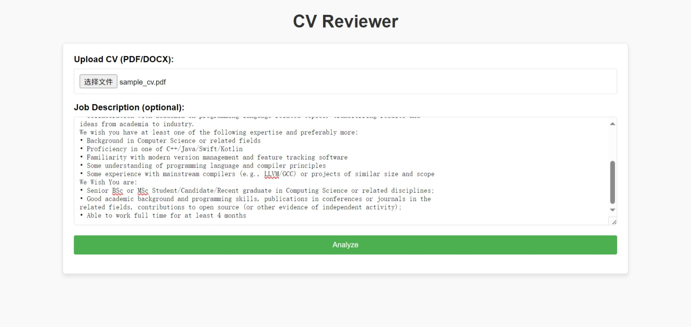
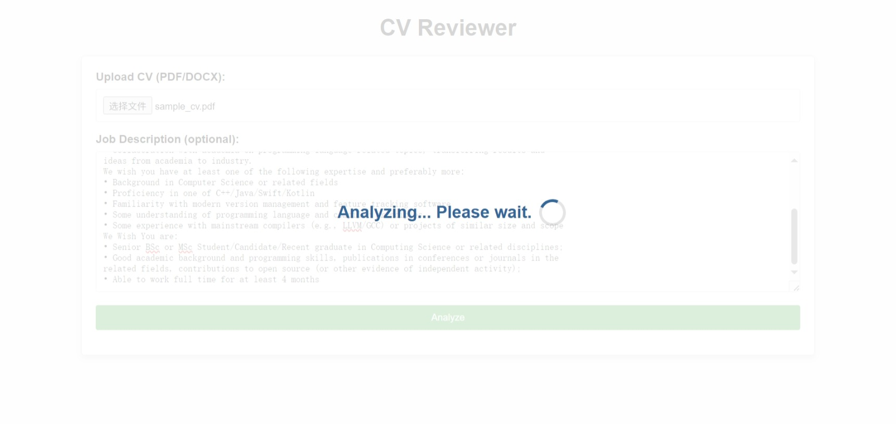
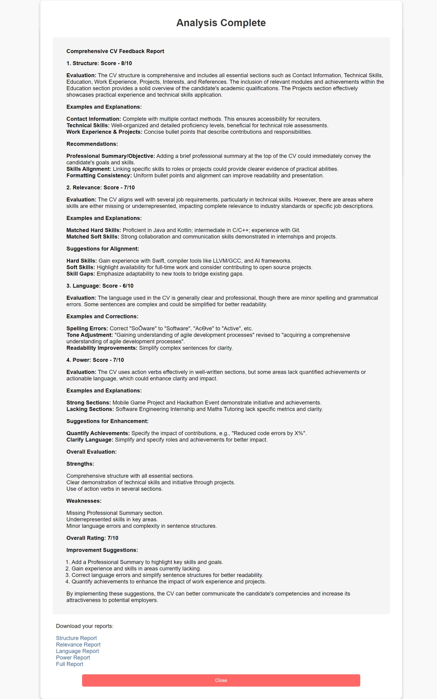

# CV Review AI Coach

CV Review AI Coach is an AI-powered tool designed to help users optimize their resumes and match specific job requirements or general industry standards. This project is built using ```CrewAI```, ```FastAPI``` and ```Docker``` and supports deployment on ```Google Cloud Run```.

## Features

- **Resume Upload and Parsing**: Supports ```PDF``` and ```DOCX``` formats.
- **Comprehensive Resume Analysis**: Analyzes resumes across four key dimensions to provide scores, detailed feedback and actionable suggestions:  
  - **Structure**: Ensures the resume contains all key sections, such as Contact Information, Work Experience, Education, and Skills.
  - **Content Relevance**: Evaluates alignment with the provided job description, identifying relevant and missing skills. If no job description is provided, it compares the resume against typical industry standards.
  - **Language and Professionalism**: Checks grammatical correctness, readability, and tone, emphasizing formal and professional language.  
  - **Power Words**: Highlights strong action words and quantifiable achievements to maximize impact and persuasiveness.  
- **Detailed Feedback Reports**: Generates modular and comprehensive reports, with download options for individual dimension or the full report.
- **Web Interaction**: Simple front-end interface for file upload, job description text input (optional), feedback display and report download.
- **Scalable Deployment**: Runs in ```Docker``` containers and deploys to ```Google Cloud Run```.

## Tech Stack

- **Core Components**: ```CrewAI``` Framework
  
    Powers the core functionality with a structured, modular approach using agents and tasks for resume analysis. This enables flexibility in defining analysis workflows and scalable processing.
  - *Agents*: Specialized components responsible for understanding the job description, analyzing various dimensions of the resume, and generating feedback.
  - *Tasks*: Modular units defining specific analysis operations, like Structure Analysis or Language Analysis, which agents execute.

- **Dependency Management**: ```Poetry```
- **Backend**: ```FastAPI```
- **Frontend**: ```HTML + CSS + JavaScript```
- **Containerization**: ```Docker```
- **Cloud Deployment**: ```Google Cloud Run```

## Getting Started

### Running Locally

1. **Clone the repository**:
    ```bash
    git clone https://github.com/RainTreeCrow/Agentic-AI-Coach.git
    cd community_submissions/cv_review_ai
    ```

2. **Install dependencies**:
   
    Install dependencies: Ensure you have ```Python 3.10``` and ```Poetry``` installed. Then run:
    ```bash
    poetry install
    ```

3. **Run the example script**:

    Run the pre-built main.py script to verify functionality. This example uses sample CV and job description files located in the ```test/data``` directory. Detailed agent logs will be displayed in the console.
    ```bash
    poetry run cv_reviewer
    ```

4. **Run the web application**:
    ```bash
    poetry run uvicorn src.cv_reviewer.app.api:app --reload
    ```
    Open your browser and go to http://127.0.0.1:8000.

### Running with Docker

1. **Build the Docker image**:
    ```bash
    docker build -t cv-reviewer .
    ```

2. **Run the Docker container**:
    ```bash
    docker run -d -p 8000:8000 cv-reviewer
    ```

3. **Access the application**:
   
    Open your browser and go to http://127.0.0.1:8000.

### Deploying to Google Cloud Run

1. **Submit the Docker build to Google Cloud Build and push to GCR**:
    ```bash
    gcloud builds submit --tag gcr.io/YOUR_PROJECT_ID/cv-reviewer
    ```
    Replace ```YOUR_PROJECT_ID``` with your actual Google Cloud project ID.

2. **Deploy the container image to Cloud Run**:
    ```bash
    gcloud run deploy cv-reviewer \
        --image gcr.io/YOUR_PROJECT_ID/cv-reviewer \
        --platform managed \
        --region YOUR_REGION \
        --allow-unauthenticated \
        --port 8000
    ```
    Replace ```YOUR_REGION``` with your desired region (e.g., ```europe-west2```).

3. **Access your deployed application**:

    After the deployment completes, you will receive a service URL. Open the URL in your browser to access your application.

## Usage Instructions

Open the web interface.
1. Upload your resume (supports ```PDF``` or ```DOCX``` formats).
2. (Optional) Enter a job description to analyze relevance.
3. Click the Analyze button and wait for the analysis to complete.
4. The results will be displayed in a modal, including:
    - Comprehensive feedback for the CV categorized into the following four areas:
      - Structure
      - Relevance
      - Language
      - Power
    - General evaluation of strengths and weaknesses of the CV.
    - Overall rating and actionable improvement suggestions.
    - Download links for detailed reports.

### Screenshots

1. **Input Form**:

    

2. **Analyzing Progress**:

    

3. **Analysis Complete**:

    

## Project Structure

```plaintext
cv_review_ai/
├── images/                      # Screenshots of the web app
├── src/
│   └── cv_reviewer/
│       ├── app/
│       │   ├── static/          # Static files (CSS, JS)
│       │   ├── templates/       # HTML templates for the web interface
│       │   ├── analyzer.py      # Analysis logic for CV and job description
│       │   └── api.py           # FastAPI routes for web and API interactions
│       ├── config/              # Configuration files
│       │   ├── agents.yaml
│       │   └── tasks.yaml
│       ├── tools/
│       │   ├── file_parser.py   # Parses and extracts text from CV files
│       │   ├── __init__.py
│       │   └── crew.py          # Custom CrewAI logic for defining agents and tasks
│       └── main.py
├── test/
│   ├── data/                    # Sample input files for testing
│   ├── output/                  # Output files generated during tests
│   ├── test_api.py              # Tests for the FastAPI endpoints
│   ├── test_crew.py             # Tests for CrewAI logic
│   └── test_file_parser.py      # Tests for the file parser functionality
├── .env.example
├── .gitignore
├── Dockerfile
├── output.txt                   # Example console output
├── poetry.lock
├── pyproject.toml
└── README.md
```

## Testing

1. Run tests:
    ```bash
    poetry run pytest
    ```
2. Tests will validate:
    - API endpoints.
    - CrewAI execution logic.
    - File parsing tool.

## License

This project is licensed under the MIT License. See the [LICENSE](../LICENSE) file for details.
